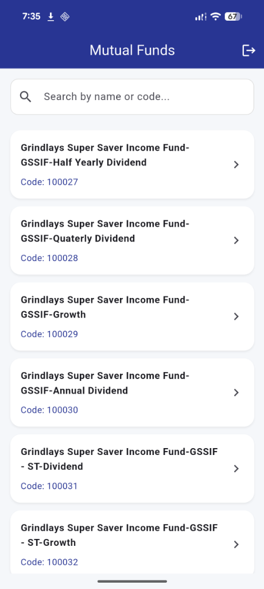
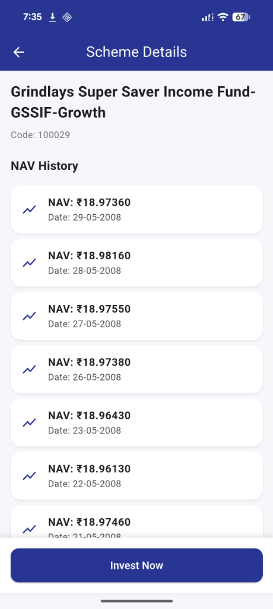

<div align="center">
  <h1>📈 Mutual Fund App</h1>
  <p>A beautiful, highly-performant Flutter app to track Mutual Fund schemes.</p>
</div>

---

## 🚀 Installation

```bash
# 1. Clone the repository
git clone https://github.com/Ritikkumar992/MutualFund.git
cd MutualFund/mutual_fund

# 2. Install dependencies
flutter pub get

# 3. Run the app
flutter run
```

> **Prerequisites**: Flutter SDK installed, an Android emulator.

## ✨ Features

* **Secure Authentication** — Email/password validation with encrypted token persistence.
* **Browse & Search** — Real-time, debounced search across thousands of schemes from MFAPI.
* **Offline Caching** — Instant data loading via local Hive DB after the first fetch.
* **Detailed Insights** — NAV history charts and simulated investments via bottom sheets.

## 🛠 Tech Stack & Architecture

This project is built using a **Feature-Based MVVM (Model-View-ViewModel)** architecture, ensuring the codebase is highly scalable, testable, and maintainable.

* **Framework**: Flutter (Material Design 3)
* **State Management**: `provider` (ChangeNotifier)
* **Networking**: `http`
* **Local Storage**: `hive` (Caching) & `flutter_secure_storage` (Auth tokens)

## 📂 Project Structure

```text
lib/
├── core/            # App-wide shared resources (Theme, Database, Storage)
└── features/        # Feature-based modules
    ├── auth/        # Login UI & ViewModels
    └── schemes/     # Mutual Fund List, Details, and ViewModels
```

## ⚡ Performance Optimizations

* **Background Isolate Parsing** — `compute()` parses 45k+ JSON records off the main thread, preventing UI jank.
* **Hive Offline Caching** — After the first API fetch, all subsequent loads are instant from the local DB.
* **Debounced Search** — 300ms delay before filtering, avoiding unnecessary widget rebuilds on every keystroke.
* **Pre-login Session Check** — Checks auth token before `runApp()`, eliminating loading spinners on startup.


## 📸 Screenshots

<div align="center">
  <table>
    <tr>
      <td align="center"><strong>Login Screen</strong></td>
      <td align="center"><strong>Scheme List</strong></td>
      <td align="center"><strong>Scheme Details</strong></td>
    </tr>
    <tr>
      <td></td>
      <td></td>
      <td></td>
    </tr>
  </table>
</div>

---
*Built with ❤️*